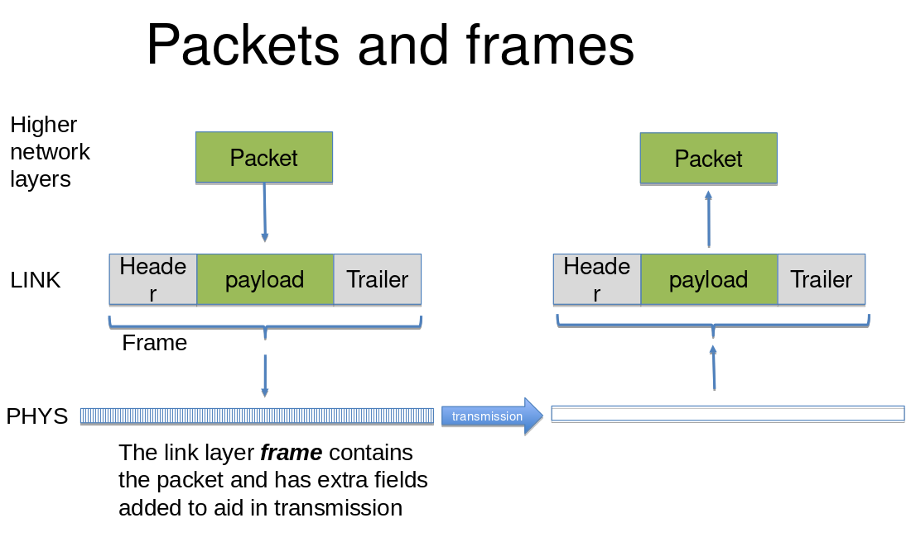

# Physical and Link Layers

There are different conventions for naming the layers, but we will be using the
Tenenbaum's names as listed below (bottom-up):

1. Physical
2. Link
3. Network
4. Transport
5. Application

## Layer Encapsulation

The topmost Application Layer only concerns itself with _data_. We use layers
1-4 to transfer that data between nodes on the network. **Layer Encapsulation**
simply states that each layer adds its set of headers like coating around the
data before sending it to the Physical Layer.

##  Media Types in the Physical Layer

- Coaxial cable
- Twisted pair
- Power line
- Fibre optic
- Wireless
- Laser, sound, ultrasonic, pulses, radar, etc.

All of these mediums are incompatible by default... And that's where the
Physical Layer comes in! It performs necessary conversions between mediums to
allow them to communicate and propagate the data further.

> Depending on the medium, you may have to use some sort of encoding to
> synchronise and clarify data boundaries.

## Link Layer

Link Layer has to chunk data up into packets (frames) for convenience and
include additional data. On the receiving end, Link Layer receives frames and
passes them up the stack.

> Link Layer also handles detection and handling of transmission errors.

Link and Physical Layers vary end-to-end since there are so many media types in
use (see [media types](media-types)). Frames differ depending on the Physical
Layer. The Link Layer can also regulate the _flow of data_ so that a slow
receiver is not overwhelmed by a fast sender.

## Link Layer Acknowledgements

This is a very important aspect about the Link Layer. There are three general
Link Layer models that may be used.

- No acknowledgements policy
    - Used for low error rate networks like wired Ethernet
    - It's connectionless in that the frames are just sent and there is no
      confirmation that they were received
- Acknowledged, connectionless service
    - Whenever we receive a packet, we sent a note back, confirming the
      transaction.
    - Very often used for wrieless 802.11, WiFi, etc.
    - 802.11n supports block acknowledgements
- Acknowledged, connection-oriented services
    - Used for long delay, unerliable links (e.g. satellite)

### Handling ACKnowledgements

- Stop-and-Wait Automatic Repeat reQuest (ARQ)
    - Send a frame, wait for ACK, send next frame, loop
    - Will not get an ACK if frame is lost or damaged
- Pipelining
    - Send multiple frames before receiving the first ACK
    - Go-back-N ARQ
        - Uses a sequence number to label each frame in flight
        - Send many frames of data; if an ACK is missed, retransmit
- Selective-Repeat ARQ
    - Similar but only transmit lost frames

## Error Detection

We typically include some error-detection bits into the frame. Link Layer will
detect errors and packet loss to trigger retransmission.

> The upper layers may have their own error detection as well.

- Parity bits: for every byte we include a 1 or a 0 to say whether it was
  supposed to have an even or odd number of 1's (will not reveal all errors)
- Cyclick Redundancy Check produces a checksum field of the frame that is
  calculated by sender and receiver and compared

> Checksums may happen at other layers too (IPv4 has one for example).

## Framing

A frame also includes some bits that show where frame starts and ends. There
are different approaches to this.

The most primitive and obvious one is the flag byte where we might assign 0xFF
as the start and stop flag byte. The problem with this approach is that we are
going to have to properly escape the 0xFF byte if it occurs in the actual data
we are transmitting. (What happens if there are two such bytes in the data side
by side??)

## MAC - Media Access Protoco

A MAC protocol manages access to/from the PHYS medium. It is part of the Link
Layer. It has a mechanism for sending frames to/from PHYS and typically manages
channels/frequencies/collisions.

It's typically _very specific_ to the PHYS Layer and may need to add extra bits
to a frame.

## Real Life Examples

### Ethernet Switch

Switch is just a simple box that hosts multiple wired Ethernet connections and
its only job is too look at packets that it receives and figure out where they
are going (which plug to send to).

This kind of connection is extremely simple and _blazingly fast_ with multiple
computers being able to talk to each other simultaneously with almost no delay
at all.

### WiFi

WiFi is essentially the wireless alternative to Ethernet. It uses the IEEE
802.11 suite of protocols that evolved over time. They work in the 2.4GHz or
5GHz range (also new 6GHz and 60GHz).

Devices associate with a wireless access point (AP): we have to _connect_
first.

There are all sorts of mechanisms to overcome the unreliable nature of these
radio channels and prevent collisions. For example, differing sub-frequencies
to create channels.

## Handling Media Contention

Original wired Ethernet used Carrier Sense Multiple Access with Collision
Detection (CSMA/CD). It is used for Ethernet on a single shared media to ensure
that only one sender is transmitting at any given time.

This is becoming useless in a modern environment.

## WiFi and Collision Avoidance

With WiFi the above technique has to be used a lot. There is an algorithm to do
that based on the channel being idle or busy. A few requests are sent to check
for confirmation before proceeding.
