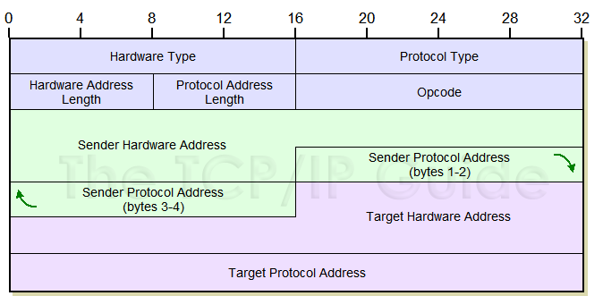

# Ethernet and LANs

Here, we'll look at some of the design and technical issues in building Ethernet
LANs.

## The Campus Challenge

The uni campus has many buildings and potentially hundreds of networked devices
in each of them. How do we build the infrastructure to facilitate networking
them all together?

## Ethernet Networks

Ethernet in its various forms is a core enabling technology for many networks.

It's used in campus networks:

- ECS has around 3K wired Ethernet points
- Currently 1Gbit/s
- Plus, widespread 802.11n wireless

And home networks where WiFi is mostly used for convenience of use but with
increasing use of powerline Ethernet.

## Ethernet Frame

> Remember, this is a _link layer_.

An Ethernet frame includes:

- 48 bit source and destination MAC address
- 802.1Q tag for optional VLAN ID and frame priority

Max Transmission Unit (MTU) is usually 1500 bytes. Larger messages are broken
down into multiple frames which are then re-assembled by the receiver.

## MAC Addresses

These are link layer addresses defined to be 48 bits extensible to 64 bits
(which should be more than enough).

They have to be unique, so first 24 bits used for vendor allocations and the
last 24 bits are assigned by vendor.

## Building Ethernet Networks

Each host typically connects to a port on a _switch_. Today, it's typically
1 Gbit/s Ethernet with servers and backbone on 10 Gbit/s.

Buildings are usually sub-divided into floors or sections with one switch per
section, then, the building becomes a network of switches.

## Ethernet Switches

They receive Ethernet frames and make a decision whether to forward the frame,
and if so, on which port. A switch can store frames, and therefore, can check
for transmission errors before forwarding.

> Some switches support more advanced functions like VLANS, QoS, etc.

## Sending IP Datagrams Over Ethernet

When you attempt to send a datagram over Ethernet, the link layer takes over to
transfer it from A to B. It encapsulates the datagram as the payload of an
Ethernet frame (IEEE 802.3 for _wired_ and IEEE 802.11 for _wireless_).

> The IP datagram has a source and destination IP address. The data is sent to
> its destination using the Ethernet layer which implies that the Network Layer
> can determine (resolve) the Ethernet address given the destination IP address.

## Address Resolution Protocol (ARP)

This protocol is used to resolve the MAC address on a LAN given an IP. It is a
very old standard used only on LANs (RFC 826).

ARP uses a _link layer_ broadcast message to the special broadcast address
`ff:ff:ff:ff:ff:ff` asking "Who has this IP address here?". This message will be
transmitted to all hosts in the same Ethernet LAN and the host with the
identified IP will respond revealing its MAC address to the computer that asked.

Once that's done, the sender can use the resulting MAC to send Ethernet frames.
The MAC will typically be cached for a period of time (e.g. 60 seconds).

## Message Types

- Unicast: one sender to one receiver.
- Broadcast: one sender to all potential receivers.
- Multicast: one sender to any number of 'interested' receivers.
- Anycast: one sender to nearest instance of a certain type of receiver.
  This can be used in services that work kind of like Torrent where you say
  "I need a piece of data like this: _describe you data_" and the _nearest_
  node that has that data will respond.

## ARP Message Format

The mains info here is that we put our own MAC and IP, and the receiver's IP
because we don't know their MAC address yet.

ARP has its own cache so the next time we pink a _known_ address, the response
will be much faster.

## Nuances of ARP

The ARP protocol is not secure. It is _very_ easy to design a system that
responds with "Yep, that's my IP and here's my MAC" to every ARP request.
This is called **spoofing**.

If you change your IP or MAC, you can send out a broadcast telling everyone on
the network about it.

## Ethernet Broadcast Domains

> How _big_ can we make a LAN to be before it becomes too big and unmanageable?

Even in a switched network, Ethernet broadcasts will flood the LAN. For a campus
with 20K devices on Ethernet and some more on wireless, there will be **a lot**
of broadcast (especially if we also consider that ARP is not the only proto that
uses broadcasting).

Because of its broadcast-based architecture, ARP can only scale so far... You
definitely won't be able to implement the whole internet as an ARP network.

We also have physical limits. Ethernet cable has a limited range (e.g. 100m for
1Gbit/s) and you can only chain so many switched together.

We mush keep Ethernet LANs limited to a reasonable size like one floor/lab.

## Connecting Ethernet LANs

When we create an Ethernet LAN with switches, all the devicces on the LAN can
talk directly to each other using their link layer (MAC addresses). A LAN will
also use a certain range of network layer IP addresses. A LAN will also use a
certain range of network layer IP addresses allocated by network admins as part
of an address plan.

If we wish to connect two such LANs together, we need to use an IP (network
layer) router that forwards IP packets between the LANs.

> Routers do not forward Ethernet (link layer) broadcasts) -- they handle IP!

The router will typically advertise to other routers the reachability of the IP
address range it directly serves using an appropriate protocol to share the
routes. This way, routers on a campus network learn where to forward IP packets.

## Ethernet Addresses And Routers

IP routers act as **network layer gateways** between individual link layer
Ethernet LANs. In other words, we use routers to create a network of LANs.

There's a special `default` router that handles traffic sent to IP addresses
which are not on the host's LAN.

> Problem: how does the sender know if destination IP is local or not?

Simple! We simply check if someone on the local LAN has the desired IP. If not,
then it must be non-local.

## Spanning Tree (802.1d)

There is a special algorithm running at the link layer to prevent the looping of
traffic in a network.

## Virtual LAns (802.1Q)

These are used to create **virtual switched networks** over fixed
infrastructure. For example, if we wanted to create a network like all staff
file share... the computers are all over the campus though... So we can pretend
they are all on the same LAN even though the trafic will have to jump over a few
switches.

To do that, there is an optional VLAN identifier -- a 12 bit value in 802.1Q tag
that gives us up to 4'096 unique VLAN IDs.

## Ethernet Frame Priority (802.1p)

For things like audio and video calls it is important to signal to the network
that these specific packets have higher importance since they have to be
processes instanteniously. To do that, there is a special 802.1Q tag. Three bits
of the tag are used to indicate the 802.1p priority level from 1 to 7.
