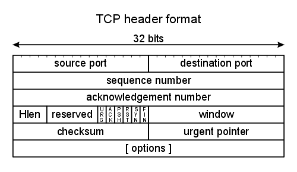
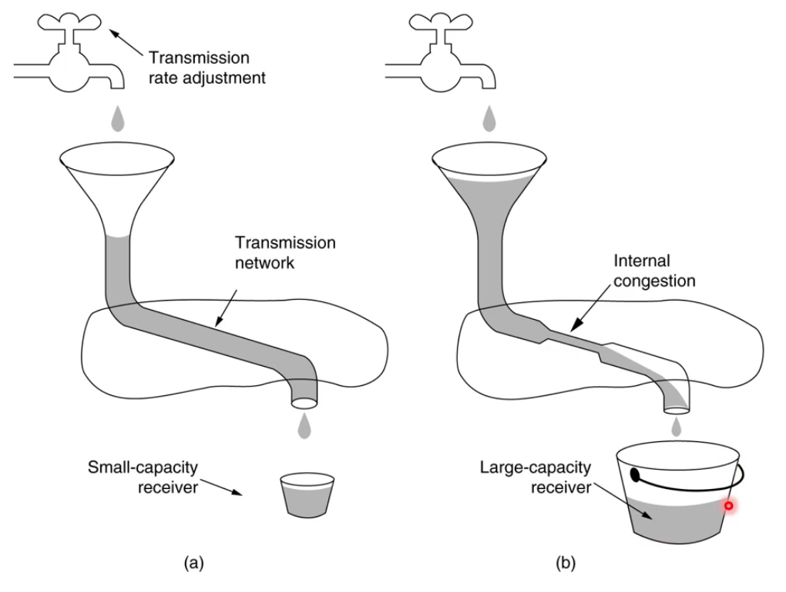
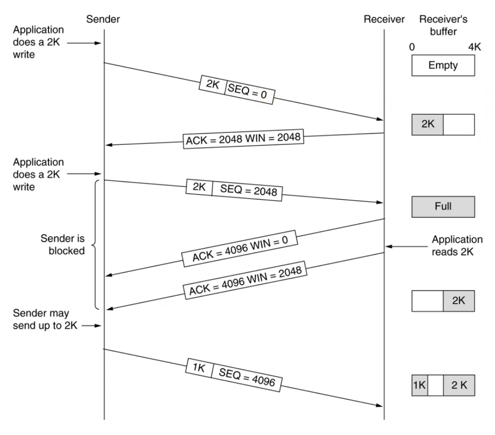

# Transport Layer

> The **Transport Layer** is used directly by the Application Layer.

As you remember, the Network and Link layers are unreliable and quite often
contain transmission errors of different kinds. The transport layer is the bit
of login and sanity that makes the lower-standing layers a bit more civilised
and usable.

## Network Topology

```
*--------*                                              *--------*
| Host A | - - - -> ( Router ) - - -> ( Router ) - - -> | Host B |
*--------*                                              *--------*
```

We imagine internet to look like this high-level representation, however, it is
far from the truth. In reality, the data hops over kilometers of wires, goes
over radio, and all that is (surprise-surprise) _unreliable and complex_. Just
as complex as trying to design an appropriate transport layer to handle all of
that mess.

Two main protocols used here are:

- UDP (connectionless)
- TCP (connection-oriented)

The IP `protocol` field in the header specifies which one is to be used.

## User Datagram Protocol (UDP)

This is the no-insurance policy, 'send and forget' kind of badass protocol.
If you wish to use it reliably, you'll have to get your **application layer** to
cope with retransmission, adaptation, and acknowledgements.

There is _no flow control_: UDP applications are often fixed bit rate.

Let's look at UDP properties:

- Connectionless
  - Sender just sends a datagram to a receiver
  - No sequence packet numbers, no acknowledgements
- Application handles retransmission
- Often used with a fixed bit rate (e.g. video streaming)
- Low overhead
  - Just like any other low-maintenance easy-fix system in computer science,
    there is practically no overhead with UDP since you just drop a packet on
    to the network
  - Uses less bandwidth for the UDP header
- Can [multicast](https://en.wikipedia.org/wiki/Multicast)
- Has variable payload size
- Lossy/congested links can drop packets
  - _Higher_ protocols can send a request back to source if needed
- Lower bandwidth links may drop packets upon their buffer fill up
  - Applications can detect this and tell server

## Transmission Control Protocol (TCP)

The TCP is

- Connection-oriented
- Includes acknowledgements and retransmissions
- Provides flow/congestion control for segments it sends
- Capable of adjusting the sending rate over time
- Uses enumerated packets

## TCP/UDP Service Model

Both sender and receiver must create a **socket** to act as a communication
endpoint. That socket has an IP address and _port number_.

Your application can listen on any free socket and there is also a number of
well known port numbers for application protocols that you should know (e.g.
`80` is HTTP, `443` is HTTPS).

Multiple clients communicate with the same server. Each client endpoint can be
assumed to be different. Servers would normally multiplex connection by using
one system thread per client endpoint to prevent clients 'queuing up' and ensure
a timely response.

## Berkeley Sockets API

| Primitive | Meaning                                                    |
| :-------: | :--------------------------------------------------------- |
| `SOCKET`  | Create a new communication endpoint                        |
|  `BIND`   | Attach a local address to a socket                         |
| `LISTEN`  | Announce willingness to accept connection; give queue size |
| `ACCEPT`  | Block the caller until a connection attempt arrives        |
| `CONNECT` | Actively attempt to establish a connection                 |
|  `SEND`   | Send some data over the connection                         |
| `RECEIVE` | Receive some data from the connection                      |
|  `CLOSE`  | Release the connection                                     |

On the server-side you `socket()` and `bind()`;
On the client-side you `socket()` and `conn()`.

## Properties of TCP

- Provides connection management
- Provides flow control
- Uses full channel capacity but tries also to avoid congestion
- Retransmission
- Receiver reassembles segments in the correct order

In other words, TCP provides performance and reliability on an otherwise
unreliable IP service.

## TCP Header



## TCP Connection

Three-way handshake (sounds kinda naughty if you ask me...).

```
       USER                             SERVER
         |                                |
         |                                |
         |                                |
         |-- ( SYN ) -------------------> *
         |                                |
         |                                |
         * <--------------- ( SYN ACK ) --|
         |                                |
         |                                |
         |-- ( ACK ) -------------------> *
         |                                |
         |                                |
         |                                |
        ...                              ...
```

## TCP Reliability

- ACKs are sent back by the receiver for every packet.
- Sender must detect lost packets by retransmission timeout.

## TCP Flow/Congestion Control



TCP is capable of adjusting the flow to tackle net congestions and accomodate
for receivers of different capacity.

To do that, it uses a _sliding window protocol_ to control the sending rate.
Sender should not send data unless receiver indicates it has buffer space to
accept it.

The 'sliding window' is effectively the buffer space the receiver says it has
available at any given time. The congestion window size starts low and increases
over time until some timeouts happen. Then, TCP will try to readjust.

## The Sliding Window



1. Sender sends a segment with a sequence number (SEQ) and starts a timer
2. Receiver replies with an ack/t number showing next sequence number it expects
   to receive and its available window (buffer) size
   - If the sender's timer goes off before (2) happens, it retransmits
3. If receiver says window size is 0, the sender may send a 1-byte probe to get
   a new window advertisement or wait until receiver indicates it has capacity

## Streaming Video

What protocol should you use to stream video over the internet? Well, not so
fast, young cowboy. First you need to decide if the video has to be LIVE or can
it be paused?

YouTube uses TCP to send chunks of video and buffer them in place on your
computer since reliability here is more important than instant streaming. Skype,
on the other hand, uses UDP because the video has to be LIVE and if we lost a
few packets here and there, it's not a biggie, and even if it is, we won't need
them out of place -- the moment's gone as they say... UDP video streaming is
also very well-suited for multicast.

Also, there's HTTP/3 standard (see [QUIC](https://en.wikipedia.org/wiki/QUIC)).
QUIC uses UDP instead of TCP under the hood and attempts to do all of the same
things but faster.

## Higher-Level Protocols

|               TCP               |               UDP                |
| :-----------------------------: | :------------------------------: |
| HTTP(S), FTP, SMTP, Telnet, SSH | DHCP, TFTP, SNMP, RIP, RTP, COAP |

### Other Interesting Transport Protocols

DCCP and SCTP that are useful for streaming.
