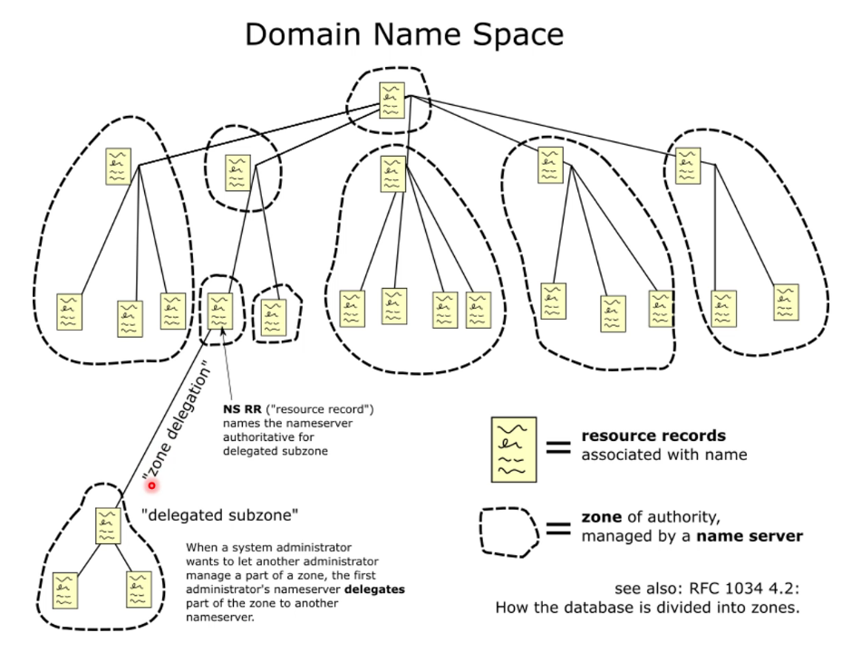

# Domains Name Servers

The DNS is an essential part of the internet. It allows us to associate
human-friendly names with real bare-bones IPs.

## Domain Names Delegation

The domain names are actually _delegated_ by specific authorities like ICANN
through the Top Level Domain (TLD) registrars.

- e.g. `soton.ac.uk` thtough Nominet (responsible for `.uk`)
- Jisc run the Janet network responsible for `.ac.uk`
- down to the UoS (`.soton.ac.uk`) where the uni will manage everything below
- like `secure.ecs.soton.ac.uk`

This allows sites or organisations to be delegated authority to maintain info
about the domains they have registered.

## Domain Name Space



## DNS Data Lookup

The most common DNS lookup is _host name_ to _IP_. The DNS returns an A record
(IPv4) or AAAA record (IPv6) when queried for a specific host/domain name.

This implicitly requires that clients (hosts, and indirectly applications) know
the IP address(es) of a local DNS server (resolver) they can query.

## DNS Resolvers

Resolvers are local DNS servers that hosts can query. Client hosts are typically
configured to use one or more local DNS resolvers. Resolver IPs are usually
provided to an IPv4 host via DHCP.

## Looking up DBS Entries

An application writer can use APIs to do DNS lookups (e.g. `getaddrinfo()` in
POSIX returns IP address from name).

You can use a command line tool to look at DNS entries (e.g. `dig`).

The DNS can also be used for some other interesting things like getting IP
telephony to work. For example, `+44 1234 56789` maps to
`9.8.7.6.5.4.3.2.1.4.4.e164.arpa`.

## DNS Lookup

The DNS lookup is usually via UDP since we don't really need reliable connection
here. If you didn't receive a response -- resend the query.

## DNS Record Types

|  Type   | Meaning            | Value                                    |
| :-----: | ------------------ | ---------------------------------------- |
|  `SOA`  | Start of euthority | Parameters for this zone                 |
|   `A`   | IP of a host       | 32-bit integer                           |
|  `MX`   | Main exchange      | Priority, domain willing to accept email |
|  `NS`   | Name server        | Name of a server for this domain         |
| `CNAME` | Canonical name     | Domain name                              |
|  `PTR`  | Pointer            | Alias for an IP address                  |
| `HINFO` | Host description   | CPU and OS in ASCII                      |
|  `TXT`  | Text               | Uninterpreted ASCII text                 |

## Dig

Try the following:

```bash
dig -t any ecs.soton.ac.uk
```

## DNS Infrastructure

A campus will run its own DNS servers to act as resolvers for internally sourced
DNS queries, ether for internal or external names _and_ to act as servers for
external queries agains internal names.

### Split DNS View

This is a concept where such campus-based DNS servers can answer differently to
the same query depending on its source (internal or external) so as to hide some
machines from external eyes or to differentiate between private/public addresses
due to IPv4 Network Address Translation.

## DNS Hierarchy

A fresh-new machine that has no IPs cached, can always query higher-standing
resolvers to work out the main bits.

A DNS resolver can therefore be configured with IP addresses for the root
servers, and then choose one from which to interavely 'walk' the hierarchy from
the root to resolve a lookup.

This hierarchy-based system means that DNS resolvers operate recursively. For
example, if we want to find `wikipedia.ord`, we do the following:

```
(1) where is wikipedia.org?    *-----------------*
             *---------------->| root nameserver |
             |                 *-----------------*
*--------------*                 | (1) try 204.74.112.1 (.org server)
| DNS resolver |<----------------*
*--------------*------------*
    ^    |     ^  (2)       |  *-----------------*
    |    |     |            *->| .org nameserver |
    |    |     *---------------*-----------------*
    |    |        (2) try 207.142.131.234
    |    |
    |    *-------------------->*--------------------------*
    |       (3)                | wikipedia.org nameserver |
    |                          *--------------------------*
    | (3) it's at xxx.xxx.xxx.xxx!     |
    *----------------------------------*
```

## DNS Caching

In practice, root servers are _not_ contacted much to prevent overloading. Most
of the time, you simply query your local resolver and they are very likely to
have _cached_ the answer already.

## DNS Protocol Messages

DNS can use TCP or UDP on port `53`. By default, it uses UDP which is much more
efficient for small/fast lookups. This, however, means that the system can be
abused by sending loads of UDP packets and basically performing a DDoS attack.

## A Resilient DNS?

The DNS is a critical internet infrastructure. If someone breaks a record of
a high-enough resolver, the system can suffer severe damage.
