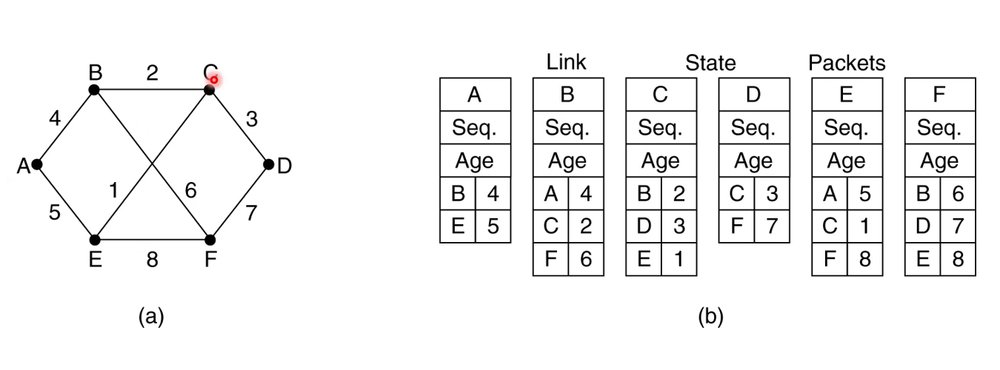

# IP Routing Protocols

Each host (like our PC) needs to know how/where to send an IP packet.

- Send directly to destination if it is on the same local subnet
- Or forward to router if destination IP is not in the same local subnet

Hosts are usually unaware of routes beyond their own subnet: they either send
locally or to their default router. The subnet router probably participates in a
site routing protocol, and the site routes to the Internet via a policy-rich
routing protocol called **Border Gateway Protocol** (BGP).

Inter-network (internet) routing is done via the Internet Service Provider (ISP)
and involves the use of BGP to communicate with hosts and sites that reside
within other networks connected to the world-wide web.

## Inside or Outside IP?

This is a simple question. We know our local network mask
(e.g. `255.255.255.0/8`) from which we can determine whether some IP is within
or without the local net. Non-local packets are sent via the **default router**.

## Routing Within a Site

You could, of course, configure all routers _manually_... However, this can lead
to all sorts of problems in cases where network topology changes or network
faults occur.

Normally, we use dynamic routing for which there is a number of intra-site
routing protocols exist. For example:

- Routing Information Protocol (RIP) - distance vector algorithm
- Open Shortest Path First (OSPF) - link state algorithm
- IS-IS - link state algorithm

## Aggregating Prefixes

Outside of a single site, routing is done differently. Sites and subnets only
advertise their common top bits like `152.78.0.0/16` to the world and then all
requests that start with these are forwarded to the local site routers. This is
called **prefix aggregation**.

## Routing Tables

Routers basically accumulate knowledge of where to forward the packet next for a
given destination. This knowledge is accumulated in a **routing table** which
contains a list of destination IP _prefixes_, and the _interface_ -- next hop to
use.

A routing protocol allows router to build or exchange routing information.

## Types of Routing Protocols

- Distance Vector:
  - Talk only to directly neighbouring routers in a site.
  - Exchange best route (shortest distance) information for any known prefixes
    with direct neighbours.
- Link State:
  - Talk to all routers to establish full knowledge of the routers/topology in a
    site.
  - Routers flood information messages describing their connected neighbours
    around entire site network.

## RIP Limitations

- Updates take around 30 seconds to be sent, so if your network is highly
  dynamic, you don't want this.
- Updates are now ack/d (UDP) which provides for some message loss possibility.
- Metrics are very simple hop count values.
- Limited to max value of 15 - a value of 16 means unreachable.
- Thus, RIP is only suitable for smaller homogenous networks.
- Routers don'e have knowledge of network topology, which can lead to the "count
  to infinity problem".

## Link State Routing

Link State Routing is the _de facto_ enterprise routing algorithm. Campuses will
typically use either IS-IS or OSPF.

Here are the steps:

1. Discover neighbours
2. Determine cost metric to each neighbour
3. Construct link state information packet
4. Flood this message to all site routers in same area
5. Use messages to build topology, and then compute shortest paths for prefixes
   served by any given router

> All routers learn the full topology to be able to independently reason about
> how to get from A to B.

## LSR Discovering Neighbours

To do that, we send a broadcast message on all interfaces. Adjacencies are built
by received `hello` messages. Then, the link cost is measured (typically based
on bandwidth/delay).

## LSR Building Link State Packets

Each router creates link state packets based on neighbours and costs to reach
them.

## LSR Distributing Link State

Flood link-state packets around the site network to share link state information
with everyone else. These packets are pretty small, so this can be done pretty
regularly.

Link state packet includes

- Source ID to uniquely identify the node
- Sequence to allow receiver to determine if message is a new one to process and
  flood, or one to discard
- Age
  - Decrement once per second
  - Prevents old messages persisting in the network

> All messages are ack/d to senders!

## LSR Computing Shortest Path Tree

Once all routers have the topology, we need to compute paths. Routers use the
Dijkstra's algorithm (from 1959!) to determine the shortest path through a graph
from an initial node to any given destination.

## Routing Between Sites

Inter-sire routign uses exterior routing protocols.

- You advertise your net prefixes to neighbouring nets
- You may or may not offer transit to other networks
- Policy is often more important than path costs!

The _de facto_ protocol here is BGP. It works between **Autonomous Systems**
(AS) like ISPs. Each ISP has a unique AS Number (ASN up to 32 bits long)
assigned by RIRs. BGP uses a distance vector-like algorithm, but includes info
about the AS path associated with using a given route, the costs of the paths,
and many other richer attributes which enable **policy** to be applied.

## BGP Operation

In config, specify IP of neighbouring and their AS. This creates a BGP perring
session (over TCP, port 179), initially sending the whole routing table, then
incremental updates.

Then you advertise routes you know to your neighbours -- containing network
prefix, prefix length, AS path, next hop, etc. Neighbours may then choose to use
that route or not.

> You know the full path, so you can detect loops if your own AS is on a path
> you receive.
