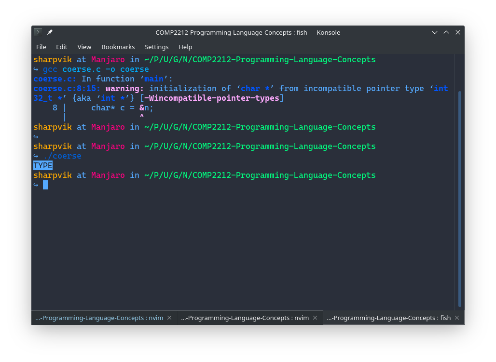
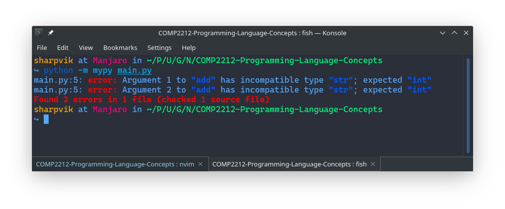

# Intro to Types

A major concern of Software Development is **correctness**. Correctness can be
ensured using a wide range of tools:

- Testing
- Formal Methods (e.g. Event B)
- Theorem Provers
- Hoare Logics
- Algebraic Specification
- Static Analysis
- Model Checking (check if some error states are reachable)
- Denotational Semantics
- Runtime Monitoring (running checker along with the code)

These ways of ensuring program correctness are considered to be too costly for
the majority of projects. However, there is a widely known method that allows us
to eliminate some errors which we're already familiar with: **Type Systems**.

The type systems are relatively lightweight and provide a great middle-ground.

## What is a Type System?

Well, first of all, what is a _type_? A type is a classification of some program
entity, an abstract notion that gives us a framework of thinking about the data
we operate.

A type _system_ then, is a way to classify all program entities -- assign a type
to each one of them. If we can do that, then we can abstract away from the low
level details and actual _values_ that are being passed. It is enough to know
that the `+` operator expects two `number`s to know that it is a mistake to try
and pass it a `string`.

> Note, that when we say that types are _abstract_, we don't mean that they are
> a weak checking mechanism -- types are very _precise_ descriptions of program
> behaviours. Do not underestimate their power!

## More On Types

Type systems can also be used to encourage **code modularity**, providing cheap
refactoring (those who can compare refactoring in TypeScript vs refactoring a
pure JavaScript, know exactly what I'm talking about).

Type systems help you maintain integrity of your data abstractions. You can also
use them to do some **information hiding** (e.g. `public` and `private` methods
of a class in Java).

All these nice things, enforce disciplined programming and help produce scalable
software systems. For example, when people started to use Python for building
bigger programs, they added type hints and a static type checker to it. Without
such tools, Python development at scale is a very time-consuming and dangerous
thing -- catching errors in production is not a good strategy for user
satisfaction.

By the way, types are also a great form of documentation: look at a function's
type signature and you can gain at least a basic understanding of what it's
doing. [Hoogle](https://hoogle.haskell.org/) takes it a step further, allowing
you to search functions based on their type signatures.

## Use of Types

**Strongly typed** languages check use of data to prevent program errors like
accessing private data, memory corruption, crashing the machine, etc.

**Weakly typed** languages don't prevent errors via type analysis but use types
for memory allocation and offsets. For exapmle, C doesn't really check types, it
only uses type signatures to know that a `char arr[4]` needs 4 bytes of memory
since one `char` takes up a byte.

Let's see how we can exploit the fact that C allows you to seamlessly coerse
types whichever way you want.

```c
#include <stdio.h>  // exposing (printf)
#include <stdint.h> // exposing (int32_t)

int main(void)
{
    //            E P Y T
    int32_t n = 0x45505954;     // Cleverly constructed 4 bytes long int.
    char* c = &n;               // Let's interpret pointer to it as char* :)
    for (int i = 0; i < 4; i++) // Let's iterate through those 4 "char"s
        printf("%c", *(c + i)); // and print each one.
    printf("\n");
    return 0;
}
```

Compiler gives us a warning, but it still compiles and prints `TYPE`. See for
yourself:



**Statically typed** languages check types at _compile time_ while **dynamically
typed** languages only do that at runtime (if at all).

## Strong vs Weak Typing

I don't like definitions, so I'll just show the difference. In a strolngly typed
language, if you have a function like this

```haskell
add :: Int -> Int -> Int
add = (+)
```

You cannot (under any circumstance) do this:

```haskell
main :: IO ()
main =
    putStrLn . show . add 3.14 42
--                    ^^^^^^^^^^^ Type mismatch!
-- `add` expects its first argument to be `Int`
-- but "hello" is of type `Float`.
```

Weakly typed languages may coerse a `double` (in case of C) to an `int` and
continue operating as if everything is ok. You've already seen an example of
`int32_t` to `char` coersion.

## Static vs Dynamic Typing

**Statically typed** languages necessarily use an **approximation** of the
runtime types of values. It is impossible to statically determine the control
flow of a program (in sufficiently rich languages).

Compile time checking can avoid costly runtime errors.

Where types are used for memory layout, static typing is appropriate (e.g. C).

**Dynamically typed** languages check the types of data at point of use at
runtime. This means that **exact** types can be used. This implies no false
negative type errors.

If is quite common to allow variables to change the type of data they store, or
objects to dynamically grow new methods. Some programmers find this convenient.

Dynamic typing is very common in scripting languages and web programming.
However, it shouldn't be used for Critical Systems where a runtime error cost is
too high to toy around!

As an interesting example, Python is dynamically typed at its core, but its
syntax ever since Python v3.7 allows programmers to include _type hints_ like
this:

```python
def add(x: int, y: int) -> int:
    return x + y
```

If you then say this:

```python
if __name__ == '__main__':
    print( add(40, 2) )
    print( add("hello", " world") )
```

... the code still runs fine on `python3 main.py`, however the `mypy` static
checker is unhappy!



## Languages and Their Types

|             |            Weak            |            Strong             |
| ----------: | :------------------------: | :---------------------------: |
| **Dynamic** | PHP, Perl, JavaScript, Lua |     Python, Lisp, Scheme      |
|  **Static** |           C, C++           | Ada, OCaml, Haskell, Java, C# |

As a note from Julian (the lecturer):

> Future programming languages are likely to feature controllable Dynamic /
> Static typed regions that may interact with each other form time to time too.

From myself, I can give you an example of Elm. Elm is a strolngly, statically
typed functional programming language for the front-end web development that
transpiles to JavaScript and has a way to communicate with native JavaScript
through a concept of ports and subscribtions system.

Elm is known to be extremely safe due to its type checks, and is actually quite
close to something you might call a really pure functional programming language
because it does most of the dirty work through messages to Elm Runtime which
simply executes them. This kinda sounds like Haskell and its `IO` monad.

Some languages like OCaml and Haskell can _infer_ types which is quite handy and
I guess, if you are trained enough, you could use Haskell as a weird twisted
scripting language.
