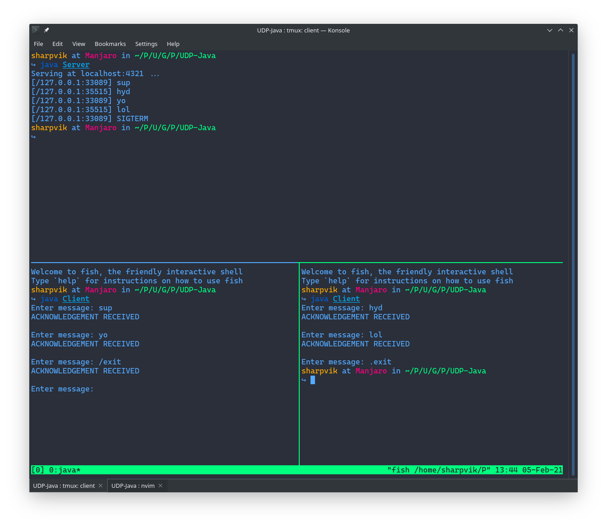

# UDP Service Diagram

## Usage

```bash
# Get the source code.
git clone git@github.com:sharpvik/Uni.git
cd Uni/Practice/UDP-Java

# Compile with JDK v14.
javac *.java

# Open multiple terminals (use tmux maybe?).
# Then, in one of them:
java Server

# And in a few others (at least one):
java Client
```

Everything else is self-explanatory. The `Server` is there to simply display
messages. The `Clients` wait for you to input your message.

## Architecture

```
  SENDER:1234                               RECEIVER:4321
       |                                          |
       |                                          |
       |                                          |
       |- (message) ----------------------------> *
       |                                          |
       |                                          |
       * <-------------------- (acknowledgement) -|
       |                                          |
       |                                          |
      ...                                        ...
```

Both `SENDER` and `RECEIVER` communicate via the UDP protocol. `RECEIVER` sends
acknowledgement of every message received from `SENDER`. The `SENDER` may not
proceed to send the next message without receiving the ack/t for the previous
one.

## Acknowledgements & Timeout

The acknowledgement constraint means that if you send a message before starting
the `RECEIVER`, the `SENDER` will forever loop, awaiting the ack/t unless we
introduce some concept of _await time limit_.

To introduce time limit, `Client` uses the `DatagramSocket.setSoTimeout` method.
The constructed socket is passed to one of the `UDPActor` constructors. The
`UDPActor` class is an omnipotent wrapper around the `DatagramSocket`. We use it
in both `Client` and `Server`.

All ack/ts are validated by the `Client` using the `Message.isAck` method.

### Multiple Clients & Interactive Commands

With this update, we officially support multiple clients on the same server.
Moreover, the `Server` also support the `/exit` command. If you ever send that
command from any client, the server will shutdown immediately.

Each `Client` also supports the `.exit` command. If you input that command as a
message, the client is going to shut down.

This is how it looks:


